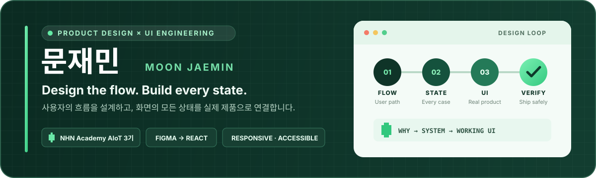
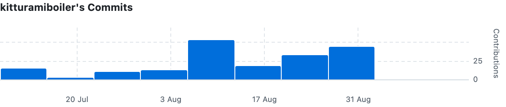

## Profile

**사용자의 행동에서 시작해, 설계 의도를 코드로 끝까지 연결하는 UI 설계자입니다.**

[NHN Academy AIoT 3기](https://github.com/nhnacademy-aiot3) 과정에서 제품의 정보 구조와 화면을 설계하고, Figma의 규칙이 실제 프론트엔드에서도 같은 경험으로 작동하도록 구현하고 있습니다.

- **Flow** · 사용자의 행동을 기준으로 정보 구조와 화면 우선순위를 설계합니다.
- **State** · 로딩·빈 값·오류·비활성까지 실제 제품의 상태로 다룹니다.
- **Delivery** · Figma의 설계 규칙을 반응형 UI와 재사용 가능한 컴포넌트로 연결합니다.
- **Validation** · 접근성·Storybook·자동 테스트로 화면의 회귀 위험을 줄입니다.

---

## Featured Work

### OMAGOTCHI

> 출석과 학습 기록을 캐릭터 성장으로 연결하는 교육용 게임 서비스 
> **8인 협업 · Home UX/UI · Responsive Frontend Rebuild**

**01 — One Home, One Flow** 
분산되어 있던 PC·모바일 화면을 단일 `/home` 진입점으로 통합했습니다.

**02 — Growth as Information Architecture** 
출석 → 학습 → 기록 → 성장이 하나의 경험으로 읽히도록 정보 구조와 화면 우선순위를 다시 설계했습니다.

**03 — From Figma to Working UI** 
Figma의 화면 규칙을 Storybook 패턴과 실제 View에 연결하고, 반응형·상태별 회귀를 확인했습니다.

**Tools** · Figma · Aseprite · React · Storybook · Vitest

#### Frontend Contribution

Home UX/UI와 반응형 리빌딩을 중심으로 프론트엔드 구현에 기여했습니다.

  

> GitHub contribution snapshot · 2026.09

---

## Original Visual Assets

OMAGOTCHI의 **캐릭터·앱 아이콘·Dock·픽셀 UI 에셋**을 
`Aseprite`와 `Figma`를 활용해 직접 제작했습니다.

**Copyright Registration** 

- 등록 저작물: **시로몽 캐릭터, 픽셀 아트 및 애니메이션**
- 저작자: **문재민 (m00n)**
- 등록번호: **제C-2026-040776호**
- 서비스 콘셉트에 맞는 캐릭터와 색상 변형 제작
- 눈 깜빡임·부유·반응 상태를 위한 PNG·GIF 에셋 구성
- 개발 실습실 콘셉트의 앱 아이콘과 픽셀 UI 에셋 제작

> OMAGOTCHI는 팀 프로젝트입니다. 위 내용은 제가 직접 제작한 시각 에셋의 범위를 의미하며, 해당 에셋의 재사용과 재배포는 사전 문의해 주세요.

---

## Toolbox

**Product Design** 

**UI Engineering** 

**Backend Fundamentals** 

**UI Validation** 

**Visual & Collaboration** 

---

## GitHub Activity

---

> **Working Principle** · 새 화면을 계속 더하기보다, 문제를 만든 기준을 먼저 바꾸려고 합니다.
