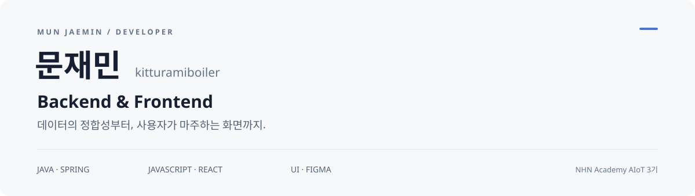
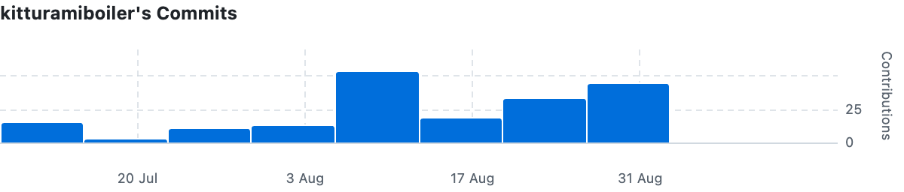

## About

**백엔드와 프론트엔드를 함께 개발하는 문재민입니다.**

Java·Spring으로 도메인 규칙과 API를 구현하고, HTML·CSS·JavaScript와 React로 사용자 화면을 만듭니다. 실패 후 재처리와 동시 요청에서도 데이터가 일관되도록 고민하며, 화면에서는 로딩·빈 데이터·오류를 구분해 보여 줍니다.

Figma를 활용한 UI 설계와 반응형 구현도 할 수 있습니다. 직접 제작한 캐릭터 **시로몽**의 저작권을 등록했으며, 개발과 시각 에셋 제작을 함께 경험했습니다.

[GitHub](https://github.com/kitturamiboiler) · [NHN Academy AIoT 3기](https://github.com/nhnacademy-aiot3)

## What I build

| Backend | Frontend | UI & Visual |
| :--- | :--- | :--- |
| Java·Spring 기반 서비스와 REST API | HTML·CSS·JavaScript, React, Thymeleaf | Figma 사용자 흐름·화면 설계 |
| 트랜잭션·Outbox·중복 처리 방지 | 반응형 레이아웃과 API 상태 처리 | Storybook 공통 UI 구성 |
| 시간 정책·경계 조건 테스트 | 키보드 조작·포커스·화면 넘침 확인 | Aseprite 캐릭터·픽셀 애니메이션 |

## Selected projects

### 01 / OMAGOTCHI

출석과 학습 시간을 캐릭터 성장으로 연결한 **8인 팀 웹 서비스**입니다.
Learning Service의 기수·출결·게이미피케이션과 Frontend의 Home·UI 구현을 담당했습니다.

**Backend — 실패와 재시도에도 일관된 데이터**

| 문제 | 해결 방법 |
| :--- | :--- |
| 출결은 저장됐지만 이벤트 발송에 실패하면 보상이 누락될 수 있음 | 출결과 **Outbox 이벤트를 같은 트랜잭션**에 기록하고, 발송 실패 시 재처리하도록 구성 |
| 이벤트 재수신이나 동시 요청으로 XP가 중복 지급될 수 있음 | **수신 영수증·XP 거래 원장·행 잠금·유니크 제약**을 조합해 중복 반영 방지 |
| 정시·지각 판정이 실행 시각과 타임존에 따라 달라질 수 있음 | 출결 시간 정책을 분리하고 **Clock 주입**으로 경계 조건을 결정론적으로 테스트 |
| 화면과 서버가 요청·응답·오류를 다르게 해석하면 연동이 어긋남 | API 계약과 권한·오류 응답 기준, **E2E 실행 절차**를 문서로 공유 |

기수 가입·권한, 출결 판정, 일일 퀘스트와 XP 지급 흐름을 구현했습니다. 정상 요청뿐 아니라 **이벤트 유실·재수신·동시 처리**를 고려해 서버의 책임 경계를 정했습니다.

**Frontend — 화면의 구조와 정보의 의미 개선**

| 문제 | 해결 방법 |
| :--- | :--- |
| PC·모바일 화면이 분산되고 작은 화면에서 HUD가 겹치거나 잘림 | 단일 **/home** 진입점으로 정리하고 고정 좌표 대신 **문서 흐름·Grid·유동 크기** 기반 반응형 레이아웃 적용 |
| 재실 조회 실패가 실제 0명처럼 표시되어 정보의 의미가 달라짐 | 정상 값으로 보이게 하는 fallback을 제거하고 **loading·empty·error** 상태를 구분 |
| 공통 UI와 실제 화면의 상태·동작을 함께 확인하기 어려움 | **Storybook 공통 UI를 실제 View와 연결**하고 Home 일부를 **React Island**로 분리 |
| 화면 크기와 입력 방식에 따라 넘침·포커스 문제가 발생할 수 있음 | 여러 화면 폭에서 넘침을 확인하고 **키보드 조작·포커스 복귀·오류 상태** 검증 |

Figma로 사용자 흐름과 Home·대시보드 화면을 설계하고, HTML·CSS·JavaScript·React·Thymeleaf로 구현했습니다. 직접 제작한 캐릭터·아이콘·픽셀 에셋도 화면에 적용했습니다.

> **검증 기록** · 2026.08.14 작업 기록 기준 UI 회귀 테스트 80개와 5개 화면 크기를 확인했습니다. 당시 구현의 검증 기록이며, 실제 사용자 대상 사용성 테스트와는 구분합니다.

`Java` `Spring Boot` `JPA` `PostgreSQL` `Redis` `Thymeleaf` `React` `Storybook` `Vitest`

[Frontend repository →](https://github.com/nhnacademy-aiot3-omagotchi/omagotchi-frontend)

프론트엔드 기여 기록 보기

 

GitHub contribution snapshot · 2026.09

### 02 / Mini Dooray

협업 도구의 프로젝트·업무 관리 기능을 구현한 팀 프로젝트입니다.

- **Project · Project Member · Tag · Milestone** 서비스와 Controller 구현
- 요청 검증과 예외 응답 정리, 담당 영역 테스트 작성
- Front·Gateway 담당자와 요청·응답 계약을 맞춰 연동

`Java` `Spring` `REST API`

### 03 / Flip-Bot

Python·discord.py 기반 경제 시뮬레이션 Discord Bot입니다.

- 명령·이벤트 처리와 사용자 자산·거래 기록 관리
- Railway 배포 후 환경변수와 실행 로그를 확인하며 오류 수정

`Python` `discord.py` `Railway`

## Skills

| 영역 | 기술·도구 |
| :--- | :--- |
| Backend | Java, Spring Boot, Spring MVC, JPA |
| Data & Messaging | PostgreSQL, MySQL, Flyway, Redis, RabbitMQ |
| Frontend | HTML, CSS, JavaScript, React, Thymeleaf, Vite |
| Test | JUnit 5, Mockito, Testcontainers, Vitest, Storybook |
| UI & Collaboration | Figma, Aseprite, Git, GitHub, Markdown |

## Original work

**시로몽 — 직접 제작한 캐릭터, 픽셀 아트 및 애니메이션**

서비스 콘셉트에 맞춰 캐릭터와 색상 변형, 눈 깜빡임 등 상태별 에셋을 제작했습니다.
앱 아이콘과 Dock·픽셀 UI 에셋도 직접 구성했습니다.

| 저작권 등록 | 내용 |
| :--- | :--- |
| 저작자 | 문재민 (m00n) |
| 등록 저작물 | 시로몽 캐릭터, 픽셀 아트 및 애니메이션 |
| 등록번호 | **제C-2026-040776호** |

> OMAGOTCHI는 팀 프로젝트이며, 위 저작권 내용은 제가 제작한 시각 에셋에 관한 것입니다. 해당 에셋의 재사용·재배포는 사전 문의해 주세요.

---

**Working principle** · 정상 동작뿐 아니라 실패·재시도·오류 상태까지 확인합니다.
